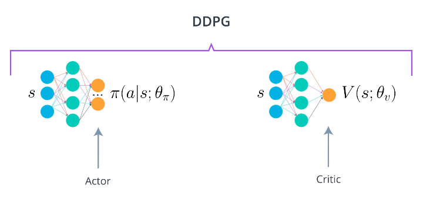
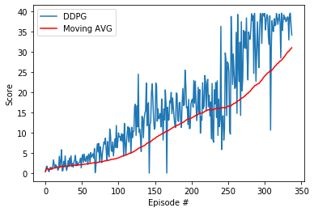
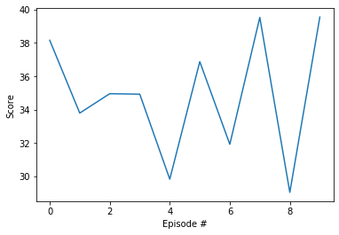

# Udacity Deep Reinforcement Learning Nano-degree

## Continuous Control Project Report

---

Ellen Zhang (yarong.zhang@gmail.com)


### Goal

Solve the [Reacher](https://github.com/Unity-Technologies/ml-agents/blob/master/docs/Learning-Environment-Examples.md#reacher) environment. The agents must move its hand to the goal location, and keep it there.


The task is episodic, and in order to solve the environment, the trained agent must get `an average score of +30 over 100 consecutive episodes`.

## 1. The envoirment 

In this environment, a double-jointed arm can move to target locations. A reward of +0.1 is provided for each step that the agent's hand is in the goal location. Thus, the goal of your agent is to maintain its position at the target location for as many time steps as possible.

The observation space consists of `33` dimensions corresponding to position, rotation, velocity, and angular velocities of the arm. Each action is a vector with `4` numbers, corresponding to torque applicable to two joints. Every entry in the action vector should be a number between -1 and 1， making the action space continuous..


### Summary of Enviroment

```
from unityagents import UnityEnvironment
env = UnityEnvironment(file_name="Reacher_Windows_x86_64/Reacher.exe")
```

```

INFO:unityagents:
'Academy' started successfully!
Unity Academy name: Academy
        Number of Brains: 1
        Number of External Brains : 1
        Lesson number : 0
        Reset Parameters :
		goal_speed -> 1.0
		goal_size -> 5.0
Unity brain name: ReacherBrain
        Number of Visual Observations (per agent): 0
        Vector Observation space type: continuous
        Vector Observation space size (per agent): 33
        Number of stacked Vector Observation: 1
        Vector Action space type: continuous
        Vector Action space size (per agent): 4
        Vector Action descriptions: , , , 
            
```


```python
# The agent just take random actions in the environment, it will get very small score. 
# Like this episod, it gets an average score of 0.34.
# But our goal is above 30.

env_info = env.reset(train_mode=False)[brain_name]     # reset the environment    
states = env_info.vector_observations                  # get the current state (for each agent)
scores = np.zeros(num_agents)                          # initialize the score (for each agent)
while True:
    actions = np.random.randn(num_agents, action_size) # select an action (for each agent)
    actions = np.clip(actions, -1, 1)                  # all actions between -1 and 1
    env_info = env.step(actions)[brain_name]           # send all actions to tne environment
    next_states = env_info.vector_observations         # get next state (for each agent)
    rewards = env_info.rewards                         # get reward (for each agent)
    dones = env_info.local_done                        # see if episode finished
    scores += env_info.rewards                         # update the score (for each agent)
    states = next_states                               # roll over states to next time step
    if np.any(dones):                                  # exit loop if episode finished
        break
print('Total score (averaged over agents) this episode: {}'.format(np.mean(scores)))
```

    Total score (averaged over agents) this episode: 0.3499999921768904
    

## 2. DDPG Algorithm

The Udacity provided DDPG code in PyTorch was used and adapted for this single agent environment.

The Monte-Carlo estimate(policy-based) is high variace but no bias, but the TD estimate(value-based) has low variance but low biased. If instead of using Monte Carlo estimates to train baselines, we use TD critic to further reduce the variance of policy-based methods. This leads to faster learning than policy-based agents alone and we also see better and more consistent convergence than value-based agents alone. 


The core of DDPG algorithm is implemented in the **Agent** class in the [ddpg_agent.py](ddpg_agent.py). It provides methods as below:

1. constructor:
    - Initialize the memory buffer (Replay Buffer)
    - Initialize the noise
    - Initialize 2 actor instance of the Neural Network : the target network and the local network
    - Initialize 2 critic instance of the Neural Network : the target network and the local network
    
    

2. step
    - Allows to Save experience / reward in the Replay Buffer/Memory
    - Learn, if enough samples are available in memory
    
    

3. act
    - returns actions for the given state as per current policy


4. learn
    - Update online critic model
        - Get predicted next-state actions and Q values from target actor models
        - Compute Q-values for the next states and actions with the target critic model
        - Compute Q values for the current states and actions with the online critic model
        - Compute critic loss
        - Minimize the loss for the online critic model
    - Update online actor model
        - Get predicted actions for current states from the online actor model
        - Compute Q-values with the online critic model
        - Compute actor loss
        - Minimize the loss for the online actor model
        
        

5. soft_update
    - softly updates the value from the target critic and actor models 
    
    

**ReplayBuffer** class provides 2 methods:
1. add
    - add an experience step to the memory
    
    
2. sample
    - randomly sample a batch of experience steps for the learning


**OUNoise** class provides 2 methods:
1. reset
    - Reset the internal state (= noise) to mean (mu)
    
    
2. sample
    - Update internal state and return it as a noise sample


### Model Architecture

In the [DDPG paper](https://arxiv.org/abs/1509.02971), they introduced this algorithm as an "Actor-Critic" method. Actor-critic methods leverage the strengths of both policy-based and value-based methods.




The DDPG algorithm uses two deep neural networks (actor-critic) with the following struture(model.py):

The actor  network:

    1. State input (33 units)
    2. Hidden layer (400 units) with ReLU activation and batch normalization
    3. Hidden layer (300 units) with ReLU activation
    4. Action output (4 units) with tanh activation


The critic network:

    1. State input (33 units)
    2. Hidden layer (400 nodes) with ReLU activation and batch normalization
    3. Action input (4 units)
    4. Hidden layer with inputs from layers 2 and 3 (300 nodes) with ReLU activation
    5. Q-value output (1 node)


## 3. The Result

The Actor-Critic methods used successfully solved the problem after around 333 episodes based on the fixed hyper parameters.


```
BUFFER_SIZE = int(1e5)  # replay buffer size
BATCH_SIZE = 128        # minibatch size
GAMMA = 0.99            # discount factor
TAU = 0.125              # for soft update of target parameters
LR_ACTOR = 1e-4         # learning rate of the actor 
LR_CRITIC = 1e-4        # learning rate of the critic
WEIGHT_DECAY = 0        # L2 weight decay
LEARN_EVERY = 20        # learning timestep interval
LEARN_NUM = 10          # number of learning passes
OU_SIGMA = 0.2          # Ornstein-Uhlenbeck noise parameter
OU_THETA = 0.15         # Ornstein-Uhlenbeck noise parameter
EPSILON = 1.0           # explore->exploit noise process added to act step
EPSILON_DECAY = 1e-6    # decay rate for noise process
```

Thanks to the peers in slack, I adopted the **TAU = 0.125**, it extremly shortened the training loop.

#### training loop
```
start = time.time()
agent = Agent(state_size=state_size, action_size=action_size, num_agents=num_agents, random_seed=4)
mean_scores, means_moving = ddpg()
end = time.time()
```

```
Episode 333 (22s)	Mean: 38.7	Moving Avg: 30.1
Episode 334 (21s)	Mean: 33.0	Moving Avg: 30.2
Episode 335 (21s)	Mean: 39.4	Moving Avg: 30.5
Episode 336 (21s)	Mean: 39.6	Moving Avg: 30.6
Episode 337 (21s)	Mean: 36.7	Moving Avg: 30.9
Episode 338 (21s)	Mean: 34.2	Moving Avg: 31.1
```

Environment solved in 238 episodes!	Average Score: 31.06

Elapsed Time: 120.96 mins.


```python
# The training scores plot
```





```python
# I tested trained agent for 10 episodes, and got an average score of 35. 
```





## 4. The future work

1. The hyperparameters(e.g. TAU) shorten the training time a lot. So a more systematic way of searching better hyperparameters, e.g. grid search, random search, bayesian optimization or genetic algorithm would be more efficient.

2. In this project, only solved the version 1, single agent problem. To Solve the version 2, multi-agent problem would be my one of the future work.


```python

```
