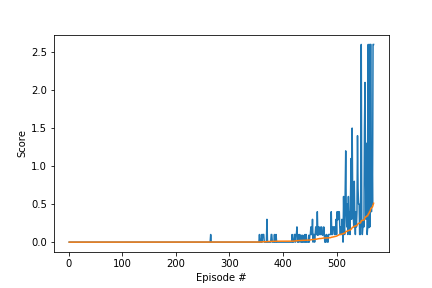
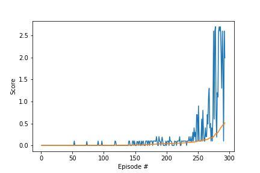

# Udacity Deep Reinforcement Learning Nano-degree

## Multi-agent Tennis Project Report

---

Ellen Zhang (yarong.zhang@gmail.com)


### Goal

Solve the [Tennis](https://github.com/Unity-Technologies/ml-agents/blob/master/docs/Learning-Environment-Examples.md#tennis) environment. 


The task is episodic, and in order to solve the environment, the agents must get `an average score of +0.5 (over 100 consecutive episodes, after taking the maximum over both agents)`. Specifically,


## 1. The envoirment 

In this environment, two agents control rackets to bounce a ball over a net. If an agent hits the ball over the net, it receives a reward of `+0.1`. If an agent lets a ball hit the ground or hits the ball out of bounds, it receives a reward of `-0.01`. Thus, the goal of each agent is to keep the ball in play.

The observation space consists of `8` variables corresponding to the position and velocity of the ball and racket. Each agent receives its own, local observation. `Two continuous actions` are available, corresponding to movement toward (or away from) the net, and jumping.

### the State and Action Spaces

```
Number of agents: 2
Size of each action: 2
There are 2 agents. Each observes a state with length: 24
```

### Summary of Enviroment

```
from unityagents import UnityEnvironment
env = UnityEnvironment(file_name="Tennis_Windows_x86_64/Tennis.exe")
```

```

INFO:unityagents:
'Academy' started successfully!
Unity Academy name: Academy
        Number of Brains: 1
        Number of External Brains : 1
        Lesson number : 0
        Reset Parameters :
		
Unity brain name: TennisBrain
        Number of Visual Observations (per agent): 0
        Vector Observation space type: continuous
        Vector Observation space size (per agent): 8
        Number of stacked Vector Observation: 3
        Vector Action space type: continuous
        Vector Action space size (per agent): 2
        Vector Action descriptions: , 
            
```
 

## 2. Multi-agent DDPG Algorithm

The learning algorithm used for this project is Multi Agent Deep Deterministic Policy Gradient(MADDPG). It is a multi-agent version DDPG algorithm. So I re-used the project 2 `ddpg_agent.py` as the `Agent` class definition. Its structure and methods can be seen in the [Project 2 Report](../p2_continuous-control/Continuous_Control_Project_Report.md)

In MADDGP, each agent has its own Actor and Critic networks, one local NN and one target NN seperately. In the Tennis project, there are 2 agents, so it is in total 4 neural networks. The agents shared a common experience replay buffer which contains states and actions tuple from all the agents. Each agent does its own sampling from this replay buffer.This make each agent can incorporate with other agents in their learning. 


## 3. The Result

I solved the Tennis environment in two ways. They all solve the environment after around 500 episodes. Every time run the same notebook got a very different result. The result fluctuated too much, from over 200 episodes to over 1000.


``Version 1``: Totally based on the project2 and changed it a little to adapt it to the project3. 

```python
def step(self, states, actions, rewards, next_states, dones):
        """Save experience in replay memory, and use random sample from buffer to learn."""
        # Save experience / reward
#         self.memory.add(state, action, reward, next_state, done)
        for i in range(self.num_agents):
            self.memory.add(states[i], actions[i], rewards[i], next_states[i], dones[i])

```


``Version 2``: I created a MAgent class, move the step function from ddpg_agent.py to maddpg_agent.py.

```python 
# in maddpg_agent.py

def step(self, states, actions, rewards, next_states, dones):
        # Save experience in replay memory
        for state, action, reward, next_state, done in zip(states, actions, rewards, next_states, dones):
            self.memory.add(state, action, reward, next_state, done)
            
        # Learn every UPDATE_EVERY time steps.
        self.t_step = (self.t_step + 1) % UPDATE_EVERY

        if self.t_step == 0:
            # If enough samples are available in memory, get random subset and learn
#             print(len(self.memory))
            if len(self.memory) > BATCH_SIZE:
                for agent in self.ddpg_agents:
                    if self.shared_replay_buffer:
                        experiences = self.memory.sample()
                    else:
                        experiences = agent.memory.sample()
                    
                    agent.learn(experiences, GAMMA)

```


#### training loop
```
start = time.time()
agent = Agent(state_size=state_size, action_size=action_size, num_agents=num_agents, random_seed=4)
mean_scores, means_moving = ddpg()
end = time.time()
```

1.
```
Episode 390 (16s)	Max: 1.5000	Mean of scores: 0.4736
Episode 400 (1s)	Max: 0.1000	Mean of scores: 0.4863

Environment solved in 401 episodes!	Average Score: 0.51

```

2.
```
Episode 540 (8s)	Max: 0.7000	Mean of scores: 0.2409
Episode 550 (3s)	Max: 0.2900	Mean of scores: 0.2889
Episode 560 (2s)	Max: 0.1900	Mean of scores: 0.3718


Environment solved in 569 episodes!	Average Score: 0.51

Elapsed Time: 13.16 mins.
```

##### The training scores plot





##### The test scores plot 


version 2: 

```
start = time.time()
magent = MAgent(state_size=state_size, action_size=action_size, num_agents=num_agents, random_seed=2, shared_replay_buffer=True)
total_scores, means_scores = maddpg()
end = time.time()
```

1.
```
Episode 400 (0s)	Max: 0.0000	Mean of scores: 0.0437
Episode 500 (5s)	Max: 0.5000	Mean of scores: 0.2785


Environment solved in 533 episodes!	Average Score: 0.50

Elapsed Time: 12.40 mins.

```

2.
```
Episode 270 (5s)	Max: 0.5000	Mean of scores: 0.1729
Episode 280 (2s)	Max: 0.1900	Mean of scores: 0.2718
Episode 290 (18s)	Max: 1.9000	Mean of scores: 0.4699


Environment solved in 293 episodes!	Average Score: 0.51

Elapsed Time: 9.86 mins.
```


##### The training scores plot





##### The test scores plot 


The best hyperparameter for now.
```
BUFFER_SIZE = int(2e5)  # replay buffer size
BATCH_SIZE = 512        # minibatch size
GAMMA = 0.99            # discount factor
TAU = 0.3              # for soft update of target parameters
LR_ACTOR = 5e-4         # learning rate of the actor 
LR_CRITIC = 5e-4        # learning rate of the critic
WEIGHT_DECAY = 0        # L2 weight decay
LEARN_EVERY = 20        # learning timestep interval
LEARN_NUM = 10          # number of learning passes
OU_SIGMA = 0.2          # Ornstein-Uhlenbeck noise parameter
OU_THETA = 0.15         # Ornstein-Uhlenbeck noise parameter
EPSILON = 1.0           # explore->exploit noise process added to act step
EPSILON_DECAY = 1e-6    # decay rate for noise process
GRAD_CLIPPING = 1.0     # Gradient Clipping
```

Below parameters only used in version 2.
```
UPDATE_EVERY = 2 
```


## 4. The future work

1. The hyperparameters are much more important than the algorithm itself. Its different combination can lead to from the relative best result to no solution. So the next step, I will focus on the hyperparameters searching work. Not only for this project.

2. Even the same Jupyter notebook, every time to run it, can get a very different result. That means the algorithm is not stable. I guess, the way to sample from the shared replay buffer caused this phenomenon. So maybe sample optimization is a better idea.

3. There are other algorithms, like PPO, D4PG can make a try.